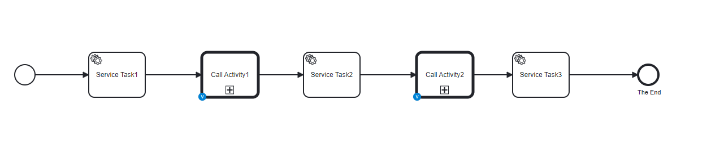
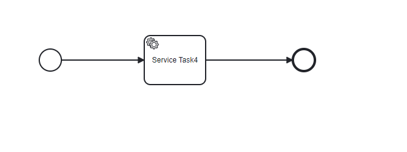

# camunda-testing-example

TESTING PROBLEM (in **main** branch):
1. A principal process (CamundaExample2.bpmn) that calls 2 subprocesses.
2. Call Activity1 is mocked
3. Call Activity2 is deployed and executed as part of the test   

